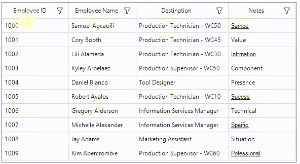

# How to Implement the Spell Checker in WinForms DataGrid?

This example illustrates how to implement the spell checker in [WinForms DataGrid](https://www.syncfusion.com/winforms-ui-controls/datagrid) (SfDataGrid).

By default, `DataGrid` does not provide the support for spell checker in `GridCell`. You can underline or highlight misspelled words within a cell from a `DataGrid` by creating the custom column like **GridSpellCheckColumn** and **SpellCheckCellRenderer** for checking the `GridCell` text in `DataGrid`.

```C#

this.sfDataGrid1.CellRenderers.Add("SpellCheck", new SpellCheckCellRenderer(this.sfDataGrid1));

public class SpellCheckCellRenderer : GridTextBoxCellRenderer
{
    //Using SpellChecker tool.
    private SpellCheckerAdv spellchecker;

    public SpellCheckCellRenderer(SfDataGrid sfdataGrid)
    {
        spellchecker = new SpellCheckerAdv();
    }

    protected override void OnRender(Graphics paint, Rectangle cellRect, string cellValue, CellStyleInfo style, DataColumnBase column, RowColumnIndex rowColumnIndex)
    {
        string check = this.spellchecker.SpellCheck(cellValue.ToString());
        //Checking whether the result has suggestions.
        if (check != "")
        {
            style.Font.Underline = true;
        }
        base.OnRender(paint, cellRect, cellValue, style, column, rowColumnIndex);
    }
}

public class GridSpellCheckColumn : GridTextColumn
{
    public GridSpellCheckColumn()
    {
        SetCellType("SpellCheck");
    }
}

```

